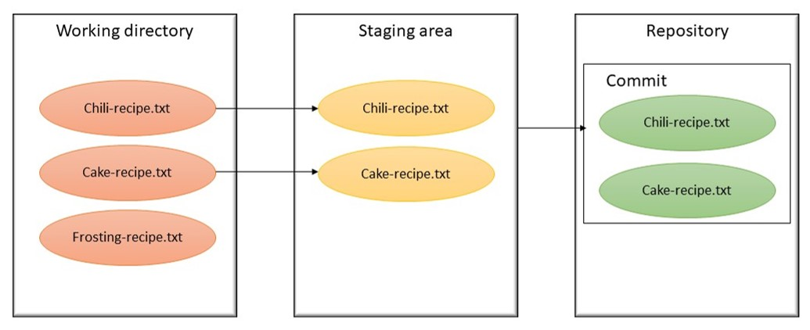
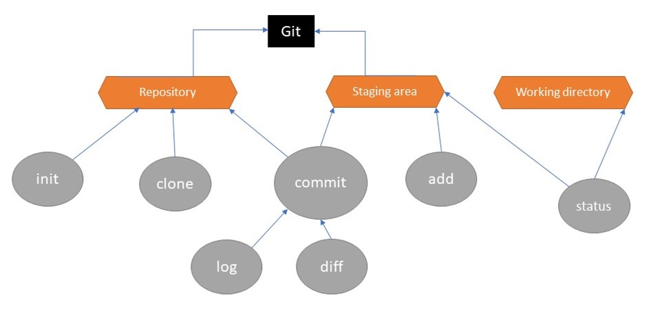

This repository is not about recipes, but I use it as testing repository of Git commands and configuration before using them in a real project. So, this README aims to resume essential Git commands and I return to it as my HELP file.

## GIT commands ##

<p align="center">

</p>

### reconfigure the username and email ###
```
git config --global --edit
```

### initialise a git repository ###
```
cd <working_directory>
git init
```
### make a copy of an entire git repository, including the history, onto your own computer ###
```
git clone <git_url>
```

### show the commits made in a repository, starting with the most recent ###
```
git log 
```

### show the status of the repository, files added, modified or removed, conflict ... ###
```
git status
```

### compare two commits, printing each line that is present in one commit but not the other ###
```
git diff <old_commit_id> <new_commit_id> (diff between two files)

git diff  (diff between working directory and staging area)

git diff --staged (diff between staging area and repository)
```

### compare a locally modified file with its remote version with meld (tap 'man git difftool' for more details and other tools)
```
git difftool --tool=meld <file_path/file_name>
```

### adding files to the staging area before commit to the repository ###
```
git add <file_name>
```

### commit changes ###
```
git commit (then type the commit message)
or
git commit -m "commit message"
```

### Changing the commit message after pushing it ###
```
git commit --amend
git push --force <example-branch>
```

### temporary reset all files in a repository to their state at the time of a specific commit ###
```
git checkout
```

### remove an added file from staging area ###
```
git remove <file_name>
```

### remove a modification from staging area and working directory ###
```
git reset --hard
```

### updating the branch to HEAD ###
```
git update-ref -d HEAD
```

### to see existant remote ###
```
git remote
git remote add origin https://github.com/mounalbaccouch/recipes.git
```

### push commits from local to repository ###
```
git push origin master
```

### in case of conflict, update the local copy with the updates from repository ###
```
git fetch origin
git merge master origin/master
```

### branches ###
```
git branch (to see existant branch)
git branch <new_branch_name> (create a branch <new_branch_name>)
git branch -d <branch_name> (delete a branch)
git checkout <branch_name> (switch to the branch <branch_name>)
git checkout -b <new_branch_name> (create new branc to retain created commits)
```

### merging two branches ###
```
git merge branch1 branch2
```

### restoring files to their state befor running "git merge" ###
```
git merge --abort
```

### show the diff between a commit and its parent ###
```
git show <commit_id>
```

### Save GitHub login ###
```
git config --global credential.helper store
git pull
```

### useful links ###
#### caching github password ####
https://help.github.com/en/github/using-git/caching-your-github-password-in-git

#### coonecting with ssh to GitHub account ####
https://help.github.com/en/github/authenticating-to-github/connecting-to-github-with-ssh

#### Git sheet ####
https://github.com/github/training-kit/blob/master/downloads/github-git-cheat-sheet.pdf

## Concept Map ##
<p align="center">

</p>

## Important notes ##
/!\ Git doesn't allow you to save a new commit if no files have been updated.

/!\ A commit saves a snapshot of all files in the repository at the time the commit was made, so checking out an earlier commit will result in all the files being reverted to their state at the time the commit was made. That is, the files will be in a consistent state.
 


